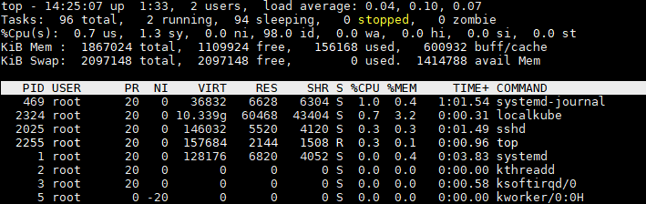

# [My Way]Linux Command--top

## top 简介
展示linux进程相关信息

## top 语法
    top -hv|-bcHiOSs -d secs -n max -u|U user -p pid -o fld -w [cols]
## top 使用
    d 指定每两次屏幕信息刷新之间的时间间隔。当然用户可以使用s交互命令来改变之。 
    p 通过指定监控进程ID来仅仅监控某个进程的状态。 
    q 该选项将使top没有任何延迟的进行刷新。如果调用程序有超级用户权限，那么top将以尽可能高的优先级运行。 
    S 指定累计模式 
    s 使top命令在安全模式中运行。这将去除交互命令所带来的潜在危险。 
    i 使top不显示任何闲置或者僵死进程。 
    c 显示整个命令行而不只是显示命令名
    Ctrl+L 擦除并且重写屏幕。 
    h或者? 显示帮助画面，给出一些简短的命令总结说明。 
    k       终止一个进程。系统将提示用户输入需要终止的进程PID，以及需要发送给该进程什么样的信号。一般的终止进程可以使用15信号；如果不能正常结束那就使用信号9强制结束该进程。默认值是信号15。在安全模式中此命令被屏蔽。 
    i 忽略闲置和僵死进程。这是一个开关式命令。 
    q 退出程序。 
    r 重新安排一个进程的优先级别。系统提示用户输入需要改变的进程PID以及需要设置的进程优先级值。输入一个正值将使优先级降低，反之则可以使该进程拥有更高的优先权。默认值是10。 
    S 切换到累计模式。 
    s 改变两次刷新之间的延迟时间。系统将提示用户输入新的时间，单位为s。如果有小数，就换算成m s。输入0值则系统将不断刷新，默认值是5 s。需要注意的是如果设置太小的时间，很可能会引起不断刷新，从而根本来不及看清显示的情况，而且系统负载也会大大增加。 
    f或者F 从当前显示中添加或者删除项目。 
    o或者O 改变显示项目的顺序。 
    l 切换显示平均负载和启动时间信息。 
    m 切换显示内存信息。 
    t 切换显示进程和CPU状态信息。 
    c 切换显示命令名称和完整命令行。 
    M 根据驻留内存大小进行排序。 
    P 根据CPU使用百分比大小进行排序。 
    T 根据时间/累计时间进行排序。 
    W 将当前设置写入~/.toprc文件中。这是写top配置文件的推荐方法。

## top 展示信息解析

    14:25:07    当前时间
    1:33        系统运行的时间---1小时33分
    2 users     当前登陆的用户数量
    load average: 0.04, 0.10, 0.07    系统负载，即任务队列的平均长度。三个数值分别为 1分钟、5分钟、15分钟前到现在的平均值。

    total       进程总数
    running     正在运行的进程数
    sleeping    睡眠的进程数
    stopped     停止的进程数
    zombie      僵尸进程数

    0.7 us      用户空间占用CPU百分比
    1.3 sy      内核空间占用CPU百分比
    0.0 ni      用户进程空间内改变过优先级的进程占用CPU百分比
    98 id       空闲CPU百分比
    0.0 wa      等待输入输出的CPU时间百分比
    0.0 hi      硬件CPU中断占用百分比
    0.0 si      软中断占用百分比
    0.0 st      虚拟机占用百分比

    1867024 total       物理内存总量
    1109924 free        空闲内存总量
    156168 used         使用的物理内存总量
    600932 buff/cache   用作内核缓存的内存量
    
    2097148 total       交换区总量
    2097148 free        空闲交换区总量
    0 used              使用的交换区总量
    1414788 avail Mem   可用内存总量

## 其他使用方式
可以通过`man top`查看具体使用方式

