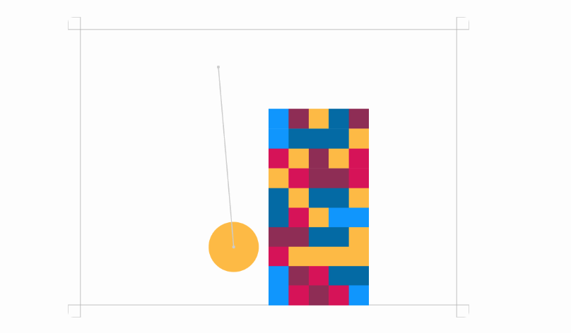
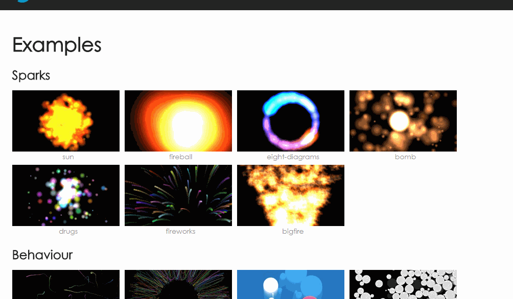
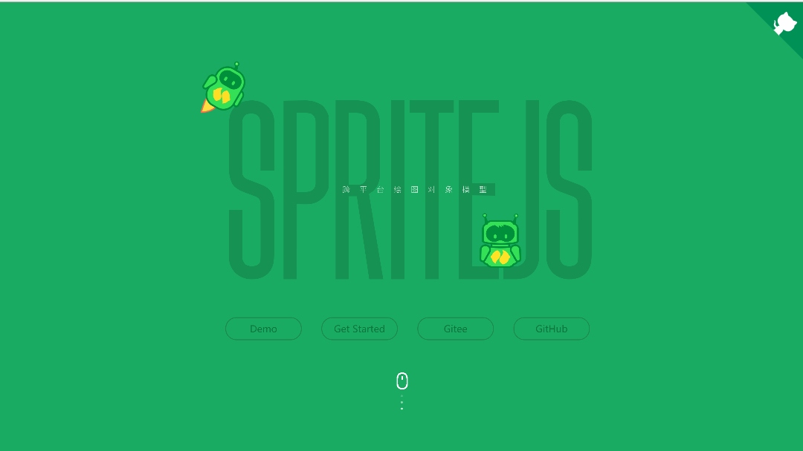
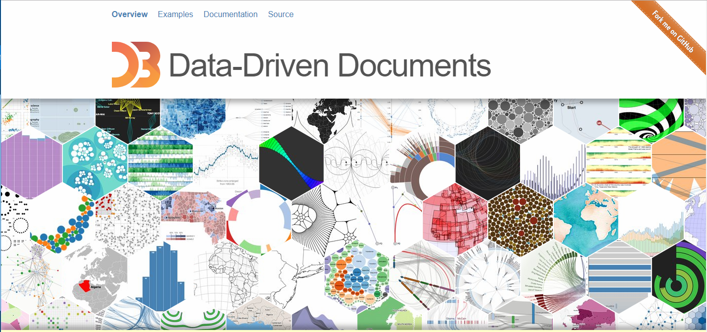
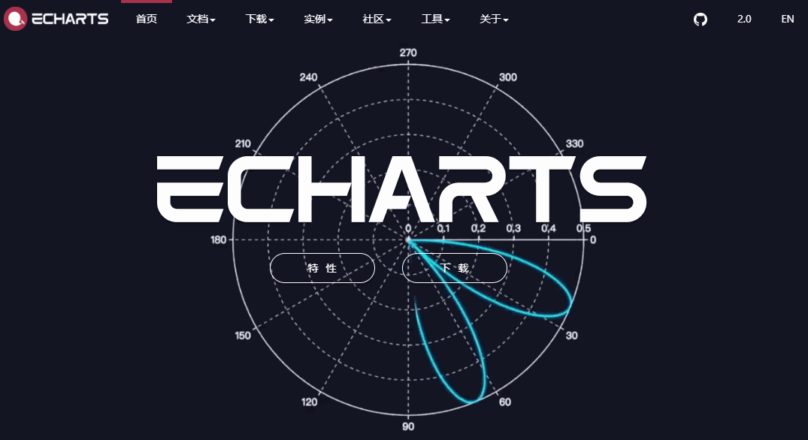
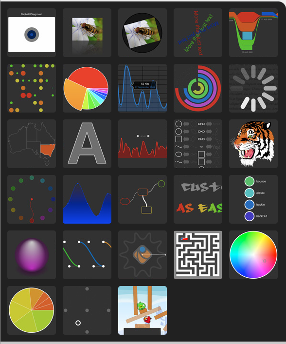

## Matter.js
Matter.js 是一个2D的javascript物理引擎

主页：http://brm.io/matter-js/

Github地址：https://github.com/liabru/matter-js

## Proton.js

Proton.js是JavaScript实现的一个粒子引擎

主页：http://a-jie.github.io/Proton/

Github地址：https://github.com/a-jie/Proton

## sprite.js
sprite.js 是360刚刚开源的一个跨平台的2D绘图对象模型库，它能够支持web、node、桌面应用和微信小程序的图形绘制和实现各种动画效果。

特性

* 像操作DOM对象一样操作画布上的图形元素
* 通过智能缓存大大提升渲染性能
* 支持多图层处理图形、文本、图像渲染
* 支持DOM事件代理、自定义事件派发
* 使用ES6+语法和面向对象编程
* 结构化对象树，对d3引擎友好，能够无缝使用
* 支持服务端渲染
* 支持微信小程序

主页：http://spritejs.org

Github地址：https://github.com/spritejs/spritejs

## D3.js
D3.js是一个JavaScript库，用于根据数据操作文档。D3帮助您使用HTML、SVG和CSS附议数据生命。D3对web标准的强调为您提供了现代浏览器的全部功能，而不需要将自己与专有框架绑定在一起，将强大的可视化组件和数据驱动的DOM操作方法结合在一起。

主页：https://d3js.org/

Github地址：https://github.com/d3/d3

## ECharts

ECharts，百度开源的一个使用 JavaScript 实现的开源可视化库，可以流畅的运行在 PC 和移动设备上，兼容当前绝大部分浏览器（IE8/9/10/11，Chrome，Firefox，Safari等），底层依赖轻量级的矢量图形库 ZRender，提供直观，交互丰富，可高度个性化定制的数据可视化图表。

主页：http://echarts.baidu.com

Github地址：https://github.com/ecomfe/echarts

## Raphaël.js

Raphaël是一个小型的JavaScript库，它可以简化你在web上的矢量图形的工作。例如，如果您想创建您自己的特定图表或图像裁剪和旋转部件，您可以简单且容易地使用这个库实现它。
Raphaël 使用SVG和VML作为创建图形的基础。这意味着您所创建的每个图形对象也是DOM对象，因此您可以附加JavaScript事件处理程序或稍后修改它们。拉比的目标是提供一个适配器，使绘图矢量艺术兼容跨浏览器和容易。
Raphaël目前支持Firefox 3.0+，Safari 3.0+，Chrome 5.0+，Opera 9.5+和Internet Explorer 6.0+。

主页：http://dmitrybaranovskiy.github.io/raphael/

Github地址：https://github.com/DmitryBaranovskiy/raphael/

